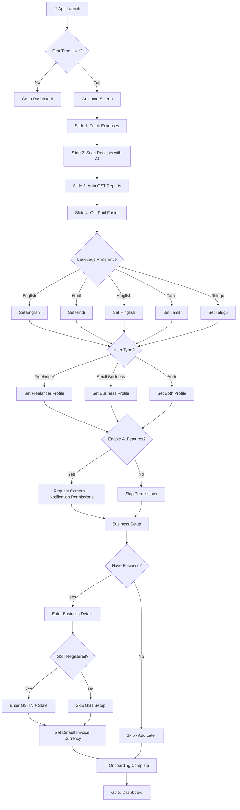
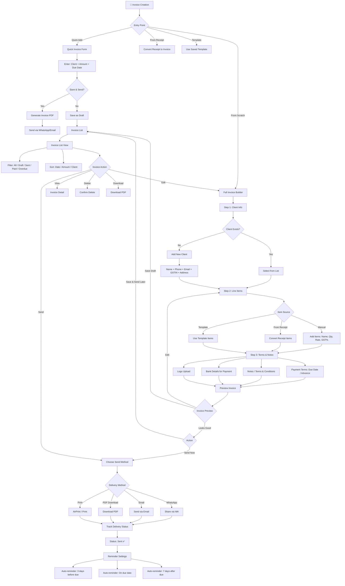
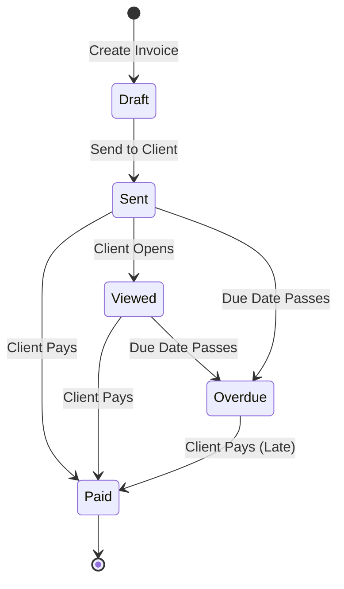
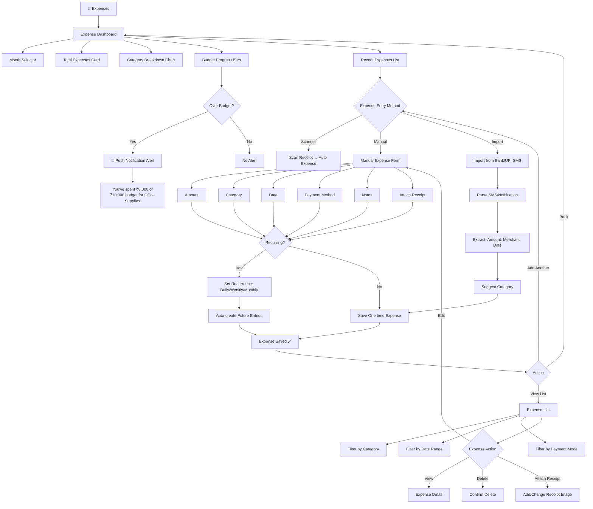

# APP_FLOW.md — User Flow Documentation
## Khatabook AI — AI-Powered Invoice & Receipt Scanner for Indian Freelancers & Small Businesses

---

## Table of Contents
1. [Overview](#overview)
2. [Onboarding Flow](#1-onboarding-flow)
3. [Landing to Signup Flow](#2-landing-to-signup-flow)
4. [Dashboard Flow](#3-dashboard-flow)
5. [Receipt Scanner Flow](#4-receipt-scanner-flow)
6. [Invoice Creation Flow](#5-invoice-creation-flow)
7. [Expense Tracking Flow](#6-expense-tracking-flow)
8. [GST Report Flow](#7-gst-report-flow)
9. [Payment & Settlement Flow](#8-payment--settlement-flow)
10. [Settings & Profile Flow](#9-settings--profile-flow)
11. [Complete User Journey Map](#10-complete-user-journey-map)

---

## Overview

Khatabook AI is designed around the daily workflow of Indian freelancers and small business owners. The app has 8 major user journeys:

| # | Flow | Entry Point |
|---|------|-------------|
| 1 | Onboarding | First app launch |
| 2 | Landing to Signup | Landing page → App |
| 3 | Dashboard | Post-login home |
| 4 | Receipt Scanner | Bottom nav / Dashboard CTA |
| 5 | Invoice Creation | Bottom nav / Quick action |
| 6 | Expense Tracking | Bottom nav / Dashboard |
| 7 | GST Reports | Bottom nav / Sidebar |
| 8 | Payment & Settlement | Invoice detail → Receive payment |

### Navigation Architecture

```
Bottom Tab Bar (Mobile):
┌──────────────────────────────────┐
│ 🏠 Home │ 📷 Scan │ ➕ Add │
├────────────┼──────────┼───────────┤
│ 💰 Invoices│ 📊 Reports│ 👤 Profile│
└──────────────────────────────────┘

Sidebar Navigation (Desktop/Tablet):
┌─────────────┐
│ Khatabook │
│ AI Logo │
├─────────────┤
│ 🏠 Dashboard│
│ 📷 Scan │
│ 📄 Invoices │
│ 💸 Expenses │
│ 🧾 GST │
│ 💰 Payments │
│ ⚙️ Settings │
└─────────────┘
```

---

## 1. Onboarding Flow



### Onboarding Screens Detail

| Screen | Elements | Actions |
|--------|----------|---------|
| Welcome | App logo, tagline, "Get Started" CTA | Tap → Slide 1 |
| Slide 1-4 | Feature illustration, title, description, dots indicator | Swipe or tap dots |
| Language | Language cards with flags, "Continue" button | Select language |
| User Type | Freelancer / Business / Both cards | Select type |
| Permissions | Camera icon + "Scan receipts", Notification icon + "Payment reminders" | Allow / Skip |
| Business Setup | Business name input, type dropdown, logo upload | Fill & Continue |
| GST Setup | GSTIN input with auto-format (XXAAAAA0000A1ZX), State dropdown | Fill or Skip |

---

## 2. Landing to Signup Flow

```mermaid
flowchart TD
 A[🌐 Landing Page] --> B[Navbar: Logo | Features | Pricing | Login]
 A --> C[Hero Section: "Manage Money Like a Pro"]
 A --> D[Trust Badges: "Trusted by 50K+ Businesses"]
 A --> E[Feature Cards: Scan · Invoice · GST · Payments]
 A --> F[How It Works: 3 Steps]
 A --> G[Testimonials Carousel]
 A --> H[Pricing Section: Free / Pro / Business]
 A --> I[Footer CTA: "Start Free Today"]

 C --> J{User Action}
 E --> J
 I --> J

 J -->|Get Started| K[Auth Modal / Page]
 J -->|Login| K
 H -->|Choose Plan| K

 K --> L{Has Account?}
 L -->|No| M[Sign Up]
 L -->|Yes| N[Log In]

 M --> O{Sign Up Method}
 O -->|Phone| P[Enter Phone Number → OTP]
 O -->|Google| Q[Google OAuth]
 O -->|Apple| R[Apple OAuth]
 O -->|Email| S[Email + Password]

 P --> T[Verify OTP]
 Q --> T
 R --> T
 S --> T

 T --> U{New User?}
 U -->|Yes| V[Start Onboarding]
 U -->|No| W[Go to Dashboard]

 N --> X[Enter Credentials]
 X --> Y{Valid?}
 Y -->|No| Z[Show Error]
 Z --> X
 Y -->|Yes| W

 V --> AA[Onboarding Flow → Section 1]
```

### Landing Page Sections

```
┌──────────────────────────────────────────────────────┐
│ NAVBAR │
│ Logo Features Pricing How It Works [Login][Sign Up]│
├──────────────────────────────────────────────────────┤
│ HERO │
│ │
│ 🧾 Khatabook AI │
│ The Smartest Way to Manage │
│ Your Business Money │
│ │
│ [Scan Receipts] [Create Invoices] [Auto GST] │
│ │
│ [📷 Try Demo] [▶ Watch Video] │
│ │
├──────────────────────────────────────────────────────┤
│ TRUST BAR │
│ ⭐ 4.8/5 | 50K+ Businesses | ₹500Cr+ Tracked │
├──────────────────────────────────────────────────────┤
│ FEATURES GRID │
│ ┌──────────┐ ┌──────────┐ ┌──────────┐ ┌──────────┐ │
│ │📷 AI Scan│ │📄 Invoice│ │🧾 GST │ │💰 Payments│ │
│ │Extract │ │Create │ │Auto │ │Track │ │
│ │data from │ │& send │ │calc & │ │& settle │ │
│ │photos │ │invoices │ │reports │ │payments │ │
│ └──────────┘ └──────────┘ └──────────┘ └──────────┘ │
├──────────────────────────────────────────────────────┤
│ HOW IT WORKS │
│ Step 1: Snap 📷 → Step 2: AI reads → Step 3: Paid 💰 │
├──────────────────────────────────────────────────────┤
│ PRICING │
│ Free (₹0) | Pro (₹149/mo) | Business (₹399/mo) │
├──────────────────────────────────────────────────────┤
│ TESTIMONIALS │
│ [★★★★★] "Saved me 10 hours/month on GST!" — Rajesh │
├──────────────────────────────────────────────────────┤
│ FOOTER CTA │
│ Ready to simplify your finances? [Start Free →] │
└──────────────────────────────────────────────────────┘
```

---

## 3. Dashboard Flow

```mermaid
flowchart TD
 A[🏠 Dashboard] --> B[Header: Greeting + Notification Bell]
 A --> C[Quick Stats Cards Row]
 A --> D[Charts Section]
 A --> E[Recent Activity Feed]
 A --> F[Quick Actions Grid]
 A --> G[Bottom Navigation Bar]

 B --> B1[Greeting: "Namaste, Rajesh 👋"]
 B --> B2[Business Name: "Rajesh Graphics"]
 B --> B3[Notification Bell with Badge]
 B3 --> B3a{Notifications}
 B3a -->|Payment received| B3b[Show toast]
 B3a -->|Invoice viewed| B3c[Show toast]
 B3a -->|GST deadline| B3d[Show alert]

 C --> C1[💵 Income Card: ₹45,200]
 C --> C2[💸 Expenses Card: ₹12,800]
 C --> C3[📄 Pending Invoices: 3]
 C --> C4[🧾 GST Due: ₹3,240]
 C --> C5[📈 Profit Card: ₹32,400]

 C1 --> C1a[Tap → Income Detail View]
 C2 --> C2a[Tap → Expense Detail View]
 C3 --> C3a[Tap → Invoice List filtered to Pending]
 C4 --> C4a[Tap → GST Reports]

 D --> D1[Income vs Expense Chart: Bar/Line]
 D --> D2[Category Breakdown: Donut Chart]
 D --> D3[Monthly Trend: Area Chart]
 D --> D4[GST Collection Trend: Bar Chart]

 E --> E1[Recent Receipts]
 E --> E2[Recent Invoices]
 E --> E3[Recent Expenses]
 E1 --> E1a{Item Type}
 E1a -->|Receipt| E1b[Tap → Receipt Detail]
 E1a -->|Invoice| E1c[Tap → Invoice Detail]
 E1a -->|Expense| E1d[Tap → Expense Detail]

 F --> F1[📷 Scan Receipt]
 F --> F2[📄 New Invoice]
 F --> F3[💸 Add Expense]
 F --> F4[🧾 GST Report]

 G --> G1[Home] --> A
 G --> G2[Scan] --> H[Scanner Screen]
 G --> G3[Invoices] --> I[Invoice List]
 G --> G4[Expenses] --> J[Expense List]
 G --> G5[Reports] --> K[Reports Dashboard]
 G --> G6[Profile] --> L[Settings]

 %% Pull-to-refresh
 A --> M[Pull Down Gesture]
 M --> N[Refresh All Data]
 N --> A
```

### Dashboard Layout

```
┌────────────────────────────────────┐
│ 🧾 Khatabook AI 🔔 (3) 👤 │ ← Header
├────────────────────────────────────┤
│ Namaste, Rajesh 👋 │ ← Greeting
│ Rajesh Graphics │
├────────┬────────┬────────┬────────┤
│ ₹45,200 │ ₹12,800│ 3 Due │₹3,240 │ ← Stats Row (scrollable)
│ Income │ Expense│Pending │ GST │
├────────┴────────┴────────┴────────┤
│ │
│ 📊 Income vs Expenses │ ← Charts
│ ┌──────────────────────────┐ │
│ │ [Bar/Line Chart] │ │
│ └──────────────────────────┘ │
│ │
│ 📈 Category Breakdown │
│ ┌────────────┐ [Donut Chart] │
│ │ Supplies │ │
│ │ Travel │ │
│ │ Software │ │
│ │ Other │ │
│ └────────────┘ │
│ │
├────────────────────────────────────┤
│ 🕐 Recent Activity │ ← Activity Feed
│ ┌──────────────────────────────┐ │
│ │ 📷 Receipt: ₹2,400 - UPI │ │
│ │ BigBasket • 2 hrs ago │ │
│ ├──────────────────────────────┤ │
│ │ 📄 Invoice #104 - Sent │ │
│ │ Client: Ramesh • 5 hrs │ │
│ ├──────────────────────────────┤ │
│ │ 💸 Expense: ₹800 - Petrol │ │
│ │ Shell Station • 1 day ago │ │
│ └──────────────────────────────┘ │
├────────────────────────────────────┤
│ ➕ Quick Actions │ ← Quick Actions
│ [📷 Scan] [📄 Invoice] [💸 Expense]│
├────────────────────────────────────┤
│ 🏠 Home 📷 Scan ➕ 📄 📊 👤 │ ← Bottom Nav
└────────────────────────────────────┘
```

---

## 4. Receipt Scanner Flow

```mermaid
flowchart TD
 A[📷 Scan Receipt] --> B[Camera View]
 B --> C{User Action}

 C -->|Take Photo| D[Capture Image]
 C -->|Upload| E[Open Gallery Picker]
 C -->|Flash| F[Toggle Flash]
 C -->|Flip| G[Switch Camera]

 E --> H[Select Image]
 H --> I[Preview Selected Image]

 D --> I
 I --> J[Confirm & Process]

 J --> K[🤖 AI Processing Screen]
 K --> K1[Show progress: "Analyzing receipt..."]
 K1 --> [OCR Extraction in Progress]
 --> K3[Data Structuring]

 K3 --> L{Processing Result}

 L -->|Success| M[Extracted Data Form]
 L -->|Partial| N[Partial Data + Manual Fields]
 L -->|Failure| O[Retry / Manual Entry]

 M --> M1[Show Extracted Fields:]
 M1 --> M2[💰 Amount: ₹2,450]
 M1 --> M3[🏪 Vendor: BigBasket]
 M1 --> M4[📅 Date: 06 Sep 2026]
 M1 --> M5[📂 Category: Groceries]
 M1 --> M6[🛒 Items: Milk, Bread, Eggs...]
 M1 --> M7[🧾 Tax: ₹78 CGST + ₹78 SGST]
 M1 --> M8[💳 Payment: UPI]

 M2 & M3 & M4 & M5 & M6 & M7 & M8 --> M9[User Can Edit Any Field]

 M9 --> M10{Save as?}
 M10 -->|Expense| M11[Save to Expenses]
 M10 -->|Invoice| M12[Save as Invoice]
 M10 -->|Both| M13[Save as Both]

 N --> M9
 O --> P[Manual Entry Form] --> M9

 M11 --> Q[💾 Save Confirmation]
 M12 --> Q
 M13 --> Q

 Q --> R{Add Another?}
 R -->|Yes| B
 R -->|No| S[Dashboard]

 %% Receipt Detail View
 T[Receipt Detail] --> T1[View Original Image]
 T --> T2[View Extracted Data]
 T --> T3[Edit Receipt]
 T --> T4[Delete Receipt]
 T --> T5[Share Receipt]
 T --> T5a[Create Invoice from Receipt]
 T --> T5b[Attach to Expense]
```

### AI Processing States

```
┌─────────────────────────────────────┐
│ 📷 Receipt Scanner │
│ │
│ ┌─────────────────────────────┐ │
│ │ │ │
│ │ [Camera Viewfinder] │ │
│ │ │ │
│ │ Align receipt within │ │
│ │ the frame │ │
│ │ │ │
│ └─────────────────────────────┘ │
│ │
│ ⬜ Focus guide overlay │
│ ┌─────────────────────────────┐ │
│ │ ╔═══════════════════════╗ │ │
│ │ ║ Place receipt here ║ │ │
│ │ ╚═══════════════════════╝ │ │
│ └─────────────────────────────┘ │
│ │
│ [📷 Capture] [🖼️ Upload] [⚡ Flash]│
└─────────────────────────────────────┘

 ↓ (Image Captured)

┌─────────────────────────────────────┐
│ ⏳ Processing... │
│ │
│ ┌─────────────────────────────┐ │
│ │ │ │
│ │ 🔄 Spinning │ │
│ │ │ │
│ │ Analyzing receipt with AI │ │
│ │ │ │
│ │ ████████████░░░░ 70% │ │
│ │ │ │
│ └─────────────────────────────┘ │
│ │
│ Step 1: OCR Extraction ✓ │
│ Step 2: Data Structuring ⏳ │
│ Step 3: Categorizing... │
└─────────────────────────────────────┘

 ↓ (Processing Complete)

┌─────────────────────────────────────┐
│ ✅ Receipt Processed │
│ │
│ Amount [₹2,450 ] │
│ Vendor [BigBasket ] │
│ Date [06 Sep 2026 ] │
│ Category [Groceries ▾ ] │
│ Items [Milk, Bread..] │
│ CGST [₹78 ] │
│ SGST [₹78 ] │
│ Payment Mode [UPI ▾ ] │
│ Notes [Optional ] │
│ │
│ [💾 Save as Expense] │
│ [📄 Save as Invoice] │
│ [🔄 Rescan] │
└─────────────────────────────────────┘
```

---

## 5. Invoice Creation Flow



### Invoice Creation — Step-by-Step UI

```
STEP 1: CLIENT INFO
┌─────────────────────────────────────┐
│ ← Back New Invoice │
├─────────────────────────────────────┤
│ Step 1 of 3: Client Information │
│ ████████████░░░░░░░░░░ │
│ │
│ Client Name* [Rajesh Kumar ] │
│ Phone* [98765 43210 ] │
│ Email [rajesh@email.com ] │
│ GSTIN [27AAPFU1234F1ZX] │
│ Billing Addr [Address lines...] │
│ │
│ [+ Save as New Client] │
│ │
│ [Continue →] │
└─────────────────────────────────────┘

STEP 2: LINE ITEMS
┌─────────────────────────────────────┐
│ ← Back New Invoice │
├─────────────────────────────────────┤
│ Step 2 of 3: Items & Services │
│ ██████████████████░░░░ │
│ │
│ # Item Qty Rate GST │
│ 1 Design 10 ₹500 18% │
│ 2 Revision 5 ₹300 18% │
│ [+ Add Item] │
│ │
│ Subtotal: ₹6,500 │
│ CGST (9%): ₹585 │
│ SGST (9%): ₹585 │
│ Round Off: -₹0 │
│ ───────────────────────────── │
│ Grand Total: ₹7,670 │
│ │
│ [← Back] [Continue →] │
└─────────────────────────────────────┘

STEP 3: TERMS & PREVIEW
┌─────────────────────────────────────┐
│ ← Back New Invoice │
├─────────────────────────────────────┤
│ Step 3 of 3: Terms & Send │
│ ████████████████████████ │
│ │
│ Invoice # [INV-104 ] │
│ Date [06 Sep 2026] │
│ Due Date [06 Oct 2026] │
│ Payment Terms [Net 30 days ▾] │
│ │
│ Bank Details │
│ [Your bank info for payments] │
│ │
│ Notes │
│ [Thank you for your business!] │
│ │
│ ┌─────────────────────────────┐ │
│ │ INVOICE PREVIEW │ │
│ │ (Live rendered PDF preview) │ │
│ └─────────────────────────────┘ │
│ │
│ [💾 Save Draft] [✉️ Send Now] │
└─────────────────────────────────────┘
```

### Invoice Status Lifecycle



| Status | Color | Description |
|--------|-------|-------------|
| Draft | Gray | Created but not sent |
| Sent | Blue | Sent to client, awaiting view |
| Viewed | Purple | Client has opened the invoice |
| Paid | Green | Payment received |
| Overdue | Red | Past due date, unpaid |

---

## 6. Expense Tracking Flow



### Expense Categories (Indian Context)

```
📂 EXPENSE CATEGORIES

Office & Supplies
 └── Stationery, Furniture, Equipment, Co-working

Travel & Transport
 └── Fuel, Metro, Cab, Flight, Hotel, Local Transport

Food & Dining
 └── Client Meals, Team Lunch, Tea/Coffee

Utilities
 └── Electricity, Internet, Mobile, Software Subs

Marketing
 └── Social Media Ads, Business Cards, Website

Professional Services
 └── CA Fees, Legal, Consultant, Freelancer Payments

Inventory/COGS
 └── Raw Materials, Manufacturing, Wholesale

Rent & Office
 └── Shop Rent, Office Rent, Maintenance

EMI & Loans
 └── Business Loan EMI, Equipment EMI

Insurance
 └── Business Insurance, Health Insurance

Miscellaneous
 └── Other uncategorized expenses
```

---

## 7. GST Report Flow

```mermaid
flowchart TD
 A[🧾 GST Reports] --> B[GST Dashboard]
 B --> B1[Current Month Summary]
 B --> B2[GSTIN Selection (if multiple)]
 B --> B3[GSTR-1 Summary Card]
 B --> B4[GSTR-3B Summary Card]
 B --> B5[ITC Summary Card]

 B1 --> C[GST Calendar View]
 C --> C1[Green: Filed]
 C --> C2[Red: Overdue]
 C --> C3[Yellow: Upcoming]
 C --> C4[Gray: No Data]

 B --> D[GSTR-1 (Outward Supplies)]
 D --> D1[Auto-generated from Invoices]
 D1 --> D2{Review Data}
 D2 -->|Correct| D3[Confirm & File]
 D2 -->|Edit| D4[Manual Edit Form]
 D4 --> D3
 D3 --> D5{File via?}
 D5 -->|NIC Portal| D6[Redirect to GSTN Portal]
 D5 -->|JSON Download| D7[Download GSTR-1 JSON]
 D5 -->|Send to CA| D8[Share with Accountant]

 B --> E[GSTR-3B (Return Summary)]
 E --> E1[Auto-calculated Summary]
 E1 --> E2[Outward Supplies]
 E1 --> E3[Inward Supplies (ITC)]
 E1 --> E4[Interest & Late Fees]
 E1 --> E5[Net Tax Payable]
 E2 --> F{Review & File}
 F -->|Confirm| G[File Return]
 F -->|Export| H[Download Report PDF/Excel]
 F -->|Send CA| I[Share Report]

 B --> J[ITC (Input Tax Credit)]
 J --> J1[Scanned Receipts with GST]
 J1 --> J2[Auto-matched with GSTR-2A]
 J --> J3[ITC Utilization Summary]
 J3 --> J4[Claimed vs Available]

 B --> K[Annual Reports]
 K --> K1[Annual GSTR-9]
 K --> [GSTR-9C (Reconciliation)]
 K --> K3[Annual Summary PDF]

 %% Compliance Calendar
 L[📅 Compliance Calendar] --> L1[GSTR-1: 10th of Next Month]
 L --> L2[GSTR-3B: 20th of Next Month]
 L --> L3[GSTR-9: 31st Dec]
 L --> L4[Payment Due: 20th of Next Month]

 L1 --> M{Reminders}
 L2 --> M
 L3 --> M
 L4 --> M
 M --> M1[7 Days Before → Email]
 M --> M2[3 Days Before → Push + SMS]
 M --> M3[1 Day Before → Urgent Push]
 M --> M4[On Due Date → Final Alert]
```

### GST Report Dashboard Layout

```
┌─────────────────────────────────────┐
│ ← Back GST Reports │
├─────────────────────────────────────┤
│ FY 2026-27 Q2 (Jul-Sep) [📅] │
│ │
│ ┌──────────┐ ┌──────────┐ │
│ │ Output │ │ Input │ │
│ │ GST │ │ GST │ │
│ │ ₹52,400 │ │ ₹18,200 │ │
│ │ ↑ 12% │ │ ↑ 8% │ │
│ └──────────┘ └──────────┘ │
│ ┌──────────┐ │
│ │ Net GST │ │
│ │ Payable │ │
│ │ ₹34,200 │ │
│ └──────────┘ │
├─────────────────────────────────────┤
│ Compliance Calendar │
│ ┌─────────────────────────────┐ │
│ │ Sep 2026 │ │
│ │ 1 2 3 4 5 6 7 │ │
│ │ 8 9 10🔴11 12 13 14 │ │
│ │ 15 16 17 18 19 20🔴21 22 │ │
│ │ 23 24 25 26 27 28 29 30 │ │
│ │ 🔴 = Due Date 🟢 = Filed │ │
│ └─────────────────────────────┘ │
├─────────────────────────────────────┤
│ GSTR-1 Summary │
│ Total Invoices: 24 │
│ Total Value: ₹4,85,000 │
│ Total Tax: ₹87,300 │
│ [Review GSTR-1 →] │
├─────────────────────────────────────┤
│ GSTR-3B Summary │
│ Outward: ₹4,85,000 │
│ Inward: ₹2,02,000 │
│ Tax Payable: ₹34,200 │
│ [Review GSTR-3B →] │
├─────────────────────────────────────┤
│ ITC Summary │
│ Available ITC: ₹18,200 │
│ Claimed ITC: ₹18,200 │
│ Pending: ₹0 │
│ [View ITC Details →] │
├─────────────────────────────────────┤
│ [📥 Download GSTR-1] │
│ [📥 Download GSTR-3B] │
│ [📊 Annual Report] │
└─────────────────────────────────────┘
```

---

## 8. Payment & Settlement Flow

```mermaid
flowchart TD
 A[💰 Payments] --> B[Payment Dashboard]
 B --> B1[Total Received: ₹38,400]
 B --> B2[Pending: ₹12,600]
 B --> B3[Overdue: ₹4,800]
 B --> B4[This Month: ₹15,000]

 B --> C[Payment Methods Accepted]
 C --> C1[UPI: Show QR Code]
 C --> C2[Bank Transfer: Show Account]
 C --> C3[Cash: Mark as Received]
 C --> C4[Cheque: Track & Clear]

 C1 --> D[Generate Payment QR]
 D --> D1[QR with UPI ID + Amount]
 D1 --> D2[Share QR via WA/Email]

 A --> E[Record Payment]
 E --> E1[Select Invoice]
 E1 --> E2{Payment Method}
 E2 -->|UPI| E2a[Enter UPI Transaction ID]
 E2 -->|Bank| E2b[Enter Reference Number]
 E2 -->|Cash| E2c[Confirm Cash Received]
 E2 -->|Cheque| E2d[Enter Cheque Number + Bank]

 E2a --> E3[Mark Invoice as Paid ✅]
 E2b --> E3
 E2c --> E3
 E2d --> E3

 E3 --> E4[Send Payment Confirmation]
 E4 --> E4a[Auto-generate Receipt]
 E4a --> E4b[Send to Client via WA/Email]

 A --> F[Payment Reminders]
 F --> F1[Upcoming Due: 3 invoices]
 F --> F2[Auto-reminder Scheduler]
 F2 --> F2a[Reminder 1: 3 days before]
 F2 --> F2b[Reminder 2: On due date]
 F2 --> F2c[Reminder 3: 7 days overdue]
 F2 --> F2d[Reminder 4: 15 days overdue]

 F2a --> F3[Send WhatsApp Reminder]
 F2b --> F3
 F2c --> F3
 F2d --> F3

 A --> G[Payment History]
 G --> G1[Filter by Date Range]
 G --> G2[Filter by Client]
 G --> G3[Filter by Method]
 G --> G4[Export as CSV/Excel]

 A --> H[UPI Auto-Reconciliation]
 H --> H1[Connect UPI App (optional)]
 H1 --> H2[Auto-detect Payments]
 H2 --> H3[Match with Pending Invoices]
 H3 --> H4[Auto-mark as Paid]
```

### Payment Flow Detail

```
SEND PAYMENT REQUEST
┌─────────────────────────────────────┐
│ Invoice #104 — Rajesh Kumar │
│ Amount Due: ₹7,670 │
│ │
│ [📱 Send via WhatsApp] │
│ [📧 Send via Email] │
│ [🔗 Copy Payment Link] │
│ [📱 Show QR Code] │
│ │
│ UPI ID: rajesh.graphics@okaxis │
│ Bank: HDFC | A/c: 50100XXXXX │
└─────────────────────────────────────┘

WHATSAPP PAYMENT MESSAGE TEMPLATE
┌─────────────────────────────────────┐
│ 🧾 Invoice #104 │
│ From: Rajesh Graphics │
│ │
│ Items: Logo Design (10 × ₹500) │
│ │
│ Total: ₹7,670 │
│ Due Date: 06 Oct 2026 │
│ │
│ Pay via UPI: │
│ rajesh.graphics@okaxis │
│ │
│ [Pay Now Button] │
│ [View Invoice PDF] │
└─────────────────────────────────────┘
```

---

## 9. Settings & Profile Flow

```mermaid
flowchart TD
 A[⚙️ Settings] --> B[Profile Section]
 A --> C[Business Settings]
 A --> D[App Preferences]
 A --> E[Notifications]
 A --> F[Data & Privacy]
 A --> G[Subscription]
 A --> H[Support]

 B --> B1[Edit Profile Photo]
 B --> B2[Edit Name]
 B --> B3[Edit Phone]
 B --> B4[Edit Email]
 B --> B5[Change Password]

 C --> C1[Business Details]
 C1 --> C1a[Business Name]
 C1 --> C1b[Business Type]
 C1 --> C1c[GSTIN]
 C1 --> C1d[State]
 C1 --> C1e[Address]
 C1 --> C1f[Logo]
 C1 --> C1g[Signature]

 C --> C2[Bank Details]
 C2 --> C2a[Account Number]
 C2 --> C2b[IFSC Code]
 C2 --> C2c[Bank Name]
 C2 --> C2d[Account Holder]

 C --> C3[Invoice Defaults]
 C3 --> C3a[Invoice Prefix]
 C3 --> C3b[Default Due Days]
 C3 --> C3c[Default Terms]
 C3 --> C3d[Default GST %]
 C3 --> C3e[Currency]
 C3 --> C3f[Logo Position]

 D --> D1[Language]
 D1 --> D1a[English / Hindi / Hinglish / Tamil / Telugu / Bengali / Marathi]
 D --> D2[Theme]
 D2 --> D2a[Light / Dark / System]
 D --> D3[Date Format]
 D3 --> D3a[DD/MM/YYYY / MM/DD/YYYY]
 D --> D4[Currency Format]
 D4 --> D4a[₹ (Indian Rupee)]
 D --> D5[Number Format]
 D5 --> D5a[Indian (1,00,000) / International (100,000)]

 E --> E1[Push Notifications]
 E1 --> E1a[Payment Received: ON/OFF]
 E1 --> E1b[Invoice Viewed: ON/OFF]
 E1 --> E1c[Invoice Due Reminder: ON/OFF]
 E1 --> E1d[GST Deadline Alert: ON/OFF]
 E1 --> E1e[Expense Budget Alert: ON/OFF]
 E1 --> E1f[Weekly Summary: ON/OFF]
 E1 --> E1g[New Feature Updates: ON/OFF]

 E --> E2[Email Notifications]
 E2 --> E2a[Invoice Sent: ON/OFF]
 E2 --> E2b[Payment Received: ON/OFF]
 E2 --> E2c[GST Reminder: ON/OFF]

 E --> E3[WhatsApp Notifications]
 E3 --> E3a[Payment Request: ON/OFF]
 E3 --> E3b[Payment Confirmation: ON/OFF]

 F --> F1[Export Data]
 F1 --> F1a[Export All as CSV]
 F1 --> F1b[Export All as Excel]
 F1 --> F1c[Export All as PDF]
 F1 --> F1d[Export All as JSON]

 F --> F2[Backup & Restore]
 F2 --> F2a[Create Backup]
 F2 --> F2b[Restore from Backup]

 F --> F3[Privacy]
 F3 --> F3a[Data Encryption Info]
 F3 --> F3b[Delete Account]
 F3 --> F3c[Privacy Policy]
 F3 --> F3d[Terms of Service]

 G --> G1[Current Plan: Free / Pro / Business]
 G --> G2[Usage: X/Y Scans]
 G --> G3[Usage: X/Y Invoices]
 G --> G4[Upgrade Plan]
 G --> G5[Billing History]
 G --> G6[Cancel Subscription]

 H --> H1[FAQs]
 H --> H2[Contact Support: Chat / Email / Call]
 H --> H3[Report Bug]
 H --> H4[Feature Request]
 H --> H5[Rate App]
```

### Settings Page Structure

```
┌─────────────────────────────────────┐
│ ← Settings │
├─────────────────────────────────────┤
│ 👤 Profile │
│ Rajesh Kumar │
│ rajesh@email.com │
│ +91 98765 43210 │
├─────────────────────────────────────┤
│ 🏢 Business │
│ Rajesh Graphics │
│ GSTIN: 27AAPFU1234F1ZX │
│ [Edit Business Details] │
├─────────────────────────────────────┤
│ 📊 Invoice Defaults │
│ Prefix: INV- │
│ Due Days: 30 │
│ Terms: Net 30 │
│ GST: 18% │
├─────────────────────────────────────┤
│ 🔔 Notifications │
│ Push: All ON │
│ Email: Payment only │
│ WhatsApp: ON │
├─────────────────────────────────────┤
│ 🌐 Preferences │
│ Language: English │
│ Theme: System │
│ Date: DD/MM/YYYY │
│ Currency: ₹ INR │
├─────────────────────────────────────┤
│ 📤 Data & Privacy │
│ Export All Data │
│ Backup & Restore │
│ Delete Account │
├─────────────────────────────────────┤
│ 💳 Subscription │
│ Plan: Free │
│ Scans: 5/10 this month │
│ [Upgrade to Pro →] │
├─────────────────────────────────────┤
│ ❓ Support & Help │
│ FAQs | Contact Us | Rate App │
└─────────────────────────────────────┘
```

---

## 10. Complete User Journey Map

### Journey 1: New Freelancer Getting Started

```
Day 1:
┌──────────┐ ┌──────────┐ ┌──────────┐ ┌──────────┐
│ Downloads │ → │ Onboards │ → │ Creates │ → │ Scans │
│ the App │ │ (2 min) │ │ First │ │ First │
│ │ │ │ │ Invoice │ │ Receipt │
└──────────┘ └──────────┘ └──────────┘ └──────────┘

Day 2-7:
┌──────────┐ ┌──────────┐ ┌──────────┐
│ Receives │ → │ Client │ → │ Views │
│ Payment │ │ Pays via │ │ Analytics │
│ Alert │ │ UPI │ │ Dashboard │
└──────────┘ └──────────┘ └──────────┘

Day 15:
┌──────────┐ ┌──────────┐ ┌──────────┐
│ Receives │ → │ Files │ → │ Gets GST │
│ GST │ │ GSTR-1 │ │ Summary │
│ Reminder │ │ Auto │ │ Report │
└──────────┘ └──────────┘ └──────────┘
```

### Journey 2: Small Business Owner (High Volume)

```
Weekly Routine:
Monday → Check Dashboard → View pending invoices
Tuesday → Scan receipts → Categorize expenses
Wednesday → Create invoices → Send via WhatsApp
Thursday → Follow up overdue → Send reminders
Friday → Review GST data → Check compliance
Saturday → Export reports → Share with CA
Sunday → Plan next week → Set budgets

Monthly:
Day 1-5 → File GSTR-1 (auto-generated)
Day 15-20 → File GSTR-3B (auto-calculated)
Day 25 → Review P&L → Plan next month
```

### Error & Edge Case Flows

```
Camera Permission Denied:
┌─────────────────────────────────────┐
│ 📷 Camera Access Required │
│ │
│ Khatabook AI needs camera access │
│ to scan receipts and invoices. │
│ │
│ [Open Settings] [Use Manual Entry]│
└─────────────────────────────────────┘

OCR Processing Failure:
┌─────────────────────────────────────┐
│ ⚠️ Couldn't Read Receipt │
│ │
│ The receipt image wasn't clear │
│ enough. Please try: │
│ • Better lighting │
│ • Flatter surface │
│ • Crop to receipt only │
│ │
│ [Retry] [Enter Manually] │
└─────────────────────────────────────┘

Network Offline:
┌─────────────────────────────────────┐
│ 📴 You're Offline │
│ │
│ Your data is saved locally and │
│ will sync when you're back online. │
│ │
│ ✅ Scanning works offline │
│ ✅ Creating invoices works offline │
│ ⏳ Reports sync when online │
└─────────────────────────────────────┘

GST Validation Error:
┌─────────────────────────────────────┐
│ ⚠️ Invalid GSTIN │
│ │
│ Please check the GSTIN format: │
│ First 2 digits: State code │
│ Next 10: PAN of entity │
│ Next 1: Entity type │
│ Next 1: Default alphabet (Z by │
│ default) │
│ Last 1: Check digit │
│ │
│ Format: XXAAAAA0000A1ZX │
│ │
│ [OK] │
└─────────────────────────────────────┘
```

---

## Appendix: State Machine for Invoice

```
 ┌─────────┐
 ┌────►│ DRAFT │◄────┐
 │ └────┬────┘ │
 │ │ Edit │
 │ │ Save │
 ┌─────────┴──┐ ┌───┴──────┐ │
 │ OVERDUE │ │ SENT │ │
 │ (Unpaid) │ └──┬───────┘ │
 └──┬────────┘ │ Viewed │
 │ │ Paid │
 ┌────┴────┐ ┌───┴────────┐ │
 │ PAID │ │ OVERDUE │──┘
 │ (Late) │ │ (Unpaid) │
 └─────────┘ └───────────┘
 ▲ │
 │ Payment Made │
 └──────────────────┘
```

## Appendix: User Permissions Matrix

| Feature | Camera | Notifications | Storage | Contacts |
|---------|--------|---------------|---------|----------|
| Receipt Scanner | Required | Optional | Optional | No |
| Invoice QR Code | No | No | No | No |
| Expense Tracking | Optional | Budget alerts | Optional | No |
| GST Reports | No | Deadline alerts | Export | No |
| Payments | No | Payment alerts | No | No |
| Backup/Restore | No | No | Required | No |
