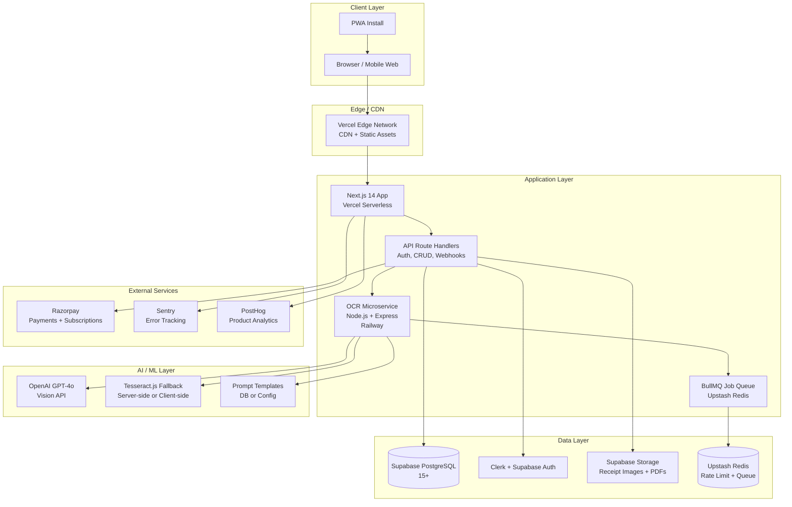

# Khatabook AI — Technical Requirements Document (TRD)

**Version:** 1.0.0 
**Date:** 2026-09-06 
**Status:** Draft 
**Authors:** Engineering Team 
**Target Audience:** Developers, QA, DevOps, Product Managers 

---

## Table of Contents

1. [Technical Overview & Architecture](#1-technical-overview--architecture)
2. [Technology Stack](#2-technology-stack)
3. [System Architecture Diagram](#3-system-architecture-diagram)
4. [API Design Principles](#4-api-design-principles)
5. [Scalability Requirements](#5-scalability-requirements)
6. [Security Requirements](#6-security-requirements)
7. [Performance Requirements](#7-performance-requirements)
8. [Third-Party Integrations](#8-third-party-integrations)
9. [Browser Compatibility](#9-browser-compatibility)
10. [Mobile Responsiveness Requirements](#10-mobile-responsiveness-requirements)
11. [Disaster Recovery & Backup Strategy](#11-disaster-recovery--backup-strategy)
12. [Monitoring & Logging](#12-monitoring--logging)
13. [Development Environment Setup](#13-development-environment-setup)
14. [Testing Strategy](#14-testing-strategy)
15. [Appendix — Glossary & References](#15-appendix--glossary--references)

---

## 1. Technical Overview & Architecture

### 1.1 Product Vision

**Khatabook AI** is an AI-powered invoice and receipt scanning platform purpose-built for Indian freelancers and small businesses. The system enables users to:

- Capture or upload receipt images via camera or file upload.
- Extract structured data (vendor name, date, items, totals, GST, invoice number) using AI-powered OCR.
- Create, send, and track invoices.
- Manage clients, track payments, and generate basic financial reports.
- Store data locally with cloud sync for backup and multi-device access.

### 1.2 Problem Statement

Indian freelancers and small businesses (SMEs) currently rely on manual entry, spreadsheets, or expensive accounting software. Receipt management is tedious and error-prone. Khatabook AI bridges this gap by combining:

- **AI-driven OCR** tailored for Indian bill formats (GST invoices, cash memos, utility bills).
- **Lightweight, fast UX** that works well on low-end Android devices and slow networks.
- **Affordable pricing** with a generous free tier and sub-INR 500/month paid plans.

### 1.3 Design Principles

| Principle | Description |
|-----------|-------------|
| **Offline-First** | Core features (create invoice, view history) work offline; syncs when connectivity returns. |
| **Privacy by Design** | Receipt images and financial data are encrypted in transit and at rest. Users own their data. |
| **Speed & Simplicity** | < 3-second OCR pipeline; 2-tap invoice creation flow. |
| **India-First** | Supports all major Indian languages for UI labels (English + Hindi initially), Indian number formats (Lakhs, Crores), and GST-compliant invoice formats. |
| **Scalable Foundations** | Architecture supports growth from 10K to 1M users without a full rewrite. |

### 1.4 Architecture Summary

Khatabook AI follows a **monorepo full-stack Next.js application** with a separated Node.js microservice for AI/OCR workloads. This gives us:

- **Unified codebase** for rapid prototyping and a small engineering team.
- **Microservice isolation** for the compute-heavy OCR pipeline (prevents blocking the web server).
- **Edge-deployable frontend** via Vercel for low-latency access across India.
- **Managed backend services** via Supabase (database, auth, storage) to reduce operational overhead.

```
Client (Browser / Mobile Web)
 │
 ▼
 Vercel CDN (Next.js Frontend)
 │
 ├──► Next.js API Routes (lightweight: auth, CRUD, webhooks)
 │
 └──► Node.js Microservice (Railway) ──► OpenAI GPT-4o / Tesseract.js
 │
 ┌──────────┴──────────┐
 │ │
 Supabase Redis (Upstash)
 (PostgreSQL) (Rate limit cache)
```

---

## 2. Technology Stack

### 2.1 Frontend

| Layer | Technology | Purpose & Rationale |
|-------|-----------|---------------------|
| **Framework** | Next.js 14 (App Router) | Server components, streaming, built-in routing, image optimization. App Router chosen over Pages Router for future-proofing and better data-fetching patterns. |
| **UI Library** | React 18.3+ | Component model, hooks, concurrent features (Suspense, transitions). |
| **Styling** | Tailwind CSS 3.4+ | Utility-first CSS, small bundle via purge, consistent design tokens. |
| **Components** | shadcn/ui | Accessible, themeable Radix-based primitives. Reduces custom component maintenance. |
| **State Management** | Zustand | Lightweight client state (invoice drafts, UI toggles). Server state handled by TanStack Query (React Query). |
| **Data Fetching** | TanStack Query (React Query) v5 | Caching, background refetch, optimistic updates for invoice lists and client data. |
| **Forms** | React Hook Form + Zod | Schema validation, type-safe forms for invoice creation and client management. |
| **Image Handling** | react-dropzone | Drag-and-drop file upload for receipts. |
| **PDF Generation** | @react-pdf/renderer | Client-side invoice PDF generation and download. |
| **i18n** | next-intl | Internationalization framework for English + Hindi (extensible to Tamil, Telugu, Bengali). |
| **Animations** | Framer Motion 11+ | Smooth transitions for modals, slide-outs, and loading states. |

### 2.2 Backend

| Layer | Technology | Purpose & Rationale |
|-------|-----------|---------------------|
| **API Layer** | Next.js API Routes (App Router Route Handlers) | Auth middleware, CRUD for invoices/clients, webhook handlers for Razorpay. Co-located with frontend for DX. |
| **AI/OCR Microservice** | Node.js 20+ (Express or Fastify) on Railway | Isolated compute for OpenAI GPT-4o calls and Tesseract.js fallback. Prevents API route timeout. Communicates via internal REST API. |
| **Job Queue** | BullMQ (Redis-backed) | Queue OCR jobs, retry on failure, track job status (pending → processing → done/failed). |
| **WebSocket** | (Future) Socket.io or Pusher | Real-time notification when OCR completes. Phase 2 feature. |

### 2.3 Database & Storage

| Service | Technology | Purpose & Rationale |
|---------|-----------|---------------------|
| **Primary Database** | PostgreSQL 15+ via Supabase | Relational data: users, invoices, clients, line items, payments. Supabase provides managed Postgres with automatic backups. |
| **ORM** | Drizzle ORM | Type-safe queries, schema migrations, lightweight (~13KB). Chosen over Prisma for better edge-runtime compatibility and smaller bundle. |
| **Caching** | Redis 7+ via Upstash | Rate limiting tokens, session cache, BullMQ job queue broker. Upstash provides serverless Redis with no infrastructure management. |
| **File Storage** | Supabase Storage | Receipt images, invoice PDFs. Signed URLs for secure client access. Lifecycle policies for automatic cleanup of old temp files. |
| **Full-Text Search** | PostgreSQL `tsvector` | Client name / invoice number search. Built-in, no extra service needed for MVP scale. |

### 2.4 AI / ML

| Service | Technology | Purpose & Rationale |
|---------|-----------|---------------------|
| **Primary OCR Engine** | OpenAI GPT-4o (gpt-4o) | Multimodal vision model. Processes receipt images directly, extracts structured JSON. Handles Indian GST invoice formats, handwritten notes, skewed images. Temperature = 0 for deterministic output. |
| **Fallback OCR** | Tesseract.js v5 | Client-side or server-side fallback when GPT-4o is unavailable or rate-limited. Lower accuracy but zero external API cost. |
| **Prompt Engineering** | + few-shot examples | Prompt templates stored in DB/config for different bill types (GST invoice, utility bill, cash memo). |

### 2.5 Authentication

| Layer | Technology | Purpose & Rationale |
|-------|-----------|---------------------|
| **Primary Auth** | Clerk | Drop-in auth with email/password, Google Sign-In, phone OTP (India). Handles session management, MFA, webhooks for user lifecycle events. Reduces auth boilerplate. |
| **Alternative / Fallback** | Supabase Auth | Used for database-level RLS policies. Clerk user ID mapped to Supabase `auth.users.id` via webhook. |
| **Authorization** | Row Level Security (RLS) in Supabase | Users can only access their own invoices, clients, and files. Enforced at the database layer. |

### 2.6 Payments

| Layer | Technology | Purpose & Rationale |
|---------|-----------|---------------------|
| **Payment Gateway** | Razorpay | India's leading payment gateway. Supports UPI, cards, net banking, wallets. Subscription billing for paid plans. |
| **Payment Processing** | Razorpay Subscriptions + Orders API | Recurring billing for Pro/Business tiers. One-time payments for add-on packs (extra OCR scans). |
| **Webhooks** | Razorpay Webhooks | Payment success/failure events → update subscription status in DB. |
| **Invoice Payments** | Razorpay Payment Links | Generate payment links from invoices. Track payment status. |

### 2.7 Deployment & Infrastructure

| Component | Platform | Purpose & Rationale |
|-----------|----------|---------------------|
| **Frontend & API Routes** | Vercel | Edge network, automatic deployments from Git, preview environments, serverless functions. Ideal for Next.js. |
| **OCR Microservice** | Railway | Simple container deployment, auto-scaling, managed Node.js hosting. Cheaper than ECS for a single microservice. |
| **Database + Auth + Storage** | Supabase Cloud | Managed PostgreSQL, Auth, Storage in one platform. Reduces vendor count. |
| **Cache / Queue** | Upstash (Redis) | Serverless Redis, pay-per-use, no infra management. |
| **DNS** | Vercel DNS or Cloudflare | SSL included, DDoS protection, fast global resolution. |
| **CI/CD** | GitHub Actions | Automated tests, lint, type-check on PR. Auto-deploy to Vercel/Railway on merge to `main`. |

### 2.8 Observability & DevOps

| Tool | Purpose |
|------|---------|
| **Sentry** | Error tracking, performance monitoring (APM), session replay. |
| **Vercel Analytics** | Web vitals, real user metrics, edge function performance. |
| **PostHog or Mixpanel** | Product analytics: feature usage, conversion funnels, retention. |
| **GitHub Actions** | CI/CD pipeline: lint → test → build → deploy. |
| **Terraform (Future)** | Infrastructure-as-code when infra complexity grows beyond what Vercel/Railway UIs handle. |

---

## 3. System Architecture Diagram



---

## 4. API Design Principles

### 4.1 RESTful Design

All API endpoints follow REST conventions:

- **Resource-oriented URLs:** `/api/v1/invoices`, `/api/v1/clients/{id}`
- **HTTP verbs:** `GET` (read), `POST` (create), `PATCH` (partial update), `DELETE` (remove)
- **Request/Response format:** JSON with consistent envelope structure.
- **Stateless:** Each request contains all information needed (auth token in `Authorization: Bearer <token>` header).

### 4.2 Versioning

- URL-based versioning: `/api/v1/...`
- Breaking changes require a new version (`/api/v2/...`)
- Non-breaking changes (new fields, new endpoints) can be added to existing version.
- Deprecation headers: `Sunset` header announced 90 days before version removal.

### 4.3 Request / Response Envelope

```json
// Success Response
{
 "success": true,
 "data": { ... },
 "meta": {
 "page": 1,
 "limit": 20,
 "total": 142,
 "requestId": "req_abc123"
 }
}

// Error Response
{
 "success": false,
 "error": {
 "code": "VALIDATION_ERROR",
 "message": "Invoice number is required",
 "details": { "field": "invoiceNumber" },
 "requestId": "req_abc123"
 }
}
```

### 4.4 Authentication & Authorization

- **Scheme:** JWT tokens issued by Clerk (`Authorization: Bearer <clerk_token>`)
- **Verification:** Clerk middleware verifies token on every API request.
- **Authorization:** Supabase RLS policies enforce row-level access. API routes never bypass RLS.
- **API Keys:** For the OCR microservice, internal API key (`X-OCR-API-Key`) used between Next.js and the microservice.

### 4.5 Rate Limiting

| Tier | Requests / Minute | Notes |
|------|------------------|-------|
| **Unauthenticated** | 20 req/min | IP-based rate limiting via Upstash Redis. |
| **Free User** | 100 req/min | Clerk user ID based. |
| **Pro User** | 500 req/min | Subscription verified via Razorpay webhook. |
| **OCR Endpoints** | 10 req/min (Free), 50 req/min (Pro) | Separate limit to prevent cost abuse. |
| **OCR Microservice** | 100 req/min | Internal, protected by API key. |

**Implementation:**
- Upstash Redis stores a sorted set per user/IP: `rate:{userId}:{windowStart}` → count.
- Middleware in Next.js checks rate limit before processing.
- `429 Too Many Requests` response includes `Retry-After` header.

### 4.6 Pagination

- **Cursor-based pagination** for invoice lists (more efficient for large datasets).
- **Offset-based pagination** for small lookup tables (categories, tags).
- Default page size: 20 items. Max: 100.

### 4.7 Idempotency

- All `POST` and `PATCH` endpoints accept `Idempotency-Key` header.
- Key stored in Redis for 24 hours. Duplicate requests return the original response.
- Critical for payment webhooks and OCR submission.

### 4.8 Error Handling

| HTTP Status | Scenario |
|-------------|----------|
| `400 Bad Request` | Validation errors, malformed JSON |
| `401 Unauthorized` | Missing or invalid auth token |
| `403 Forbidden` | Valid auth but insufficient permissions |
| `404 Not Found` | Resource doesn't exist |
| `409 Conflict` | Duplicate invoice number, idempotency key collision |
| `422 Unprocessable` | Business logic validation (e.g., invoice total mismatch) |
| `429 Too Many Requests` | Rate limit exceeded |
| `500 Internal Server` | Unhandled server error |
| `503 Service Unavailable` | OCR service down, maintenance mode |

### 4.9 API Documentation

- OpenAPI 3.1 spec generated from Zod schemas (using `zod-to-openapi`).
- Served at `/api/docs` (Swagger UI) in development and staging.
- Published as interactive docs on the product site for third-party integrations (future).

---

## 5. Scalability Requirements

### 5.1 User Scaling Targets

| Metric | Target (10K) | Target (100K) | Target (1M) |
|--------|-------------|--------------|------------|
| **Concurrent Users** | 500 | 5,000 | 50,000 |
| **Invoices per Day** | 2,000 | 20,000 | 200,000 |
| **OCR Jobs per Day** | 500 | 5,000 | 50,000 |
| **Storage (Images + PDFs)** | ~50 GB | ~500 GB | ~5 TB |
| **Database Size** | ~5 GB | ~50 GB | ~500 GB |
| **API Requests / Day** | 100K | 1M | 10M |

### 5.2 Horizontal Scaling Strategy

| Component | Scaling Approach |
|-----------|-----------------|
| **Vercel Frontend** | Automatic — Vercel scales serverless functions to zero and back. Edge caching via Vercel Edge Network. |
| **Next.js API Routes** | Automatic — Vercel serverless functions scale per-request. No manual scaling needed up to 1M users. |
| **OCR Microservice** | Railway auto-scaling: scale from 1 to N instances based on queue depth. BullMQ ensures jobs are distributed across instances. |
| **Supabase PostgreSQL** | Supabase Pro tier: up to 8 CPU, 32 GB RAM, 1 TB storage. Connection pooling via Supabase's built-in pooler (PgBouncer). At 1M users, consider read replicas. |
| **Upstash Redis** | Serverless auto-scaling. Pay-per-request. Handles 1M+ ops/sec on Pro tier. |
| **Supabase Storage** | Object storage scales automatically. CDN-backed for fast global access. |

### 5.3 Database Scaling

- **Connection Pooling:** Supabase PgBouncer in transaction mode. Max 200 connections (serverless) to 1000 (dedicated).
- **Indexing Strategy:**
 - `invoices(user_id, created_at DESC)` — primary query pattern.
 - `invoices(tenant_id, status)` — for filtering by payment status.
 - `clients(user_id, name)` — for client search.
 - GIN index on `tsvector` column for full-text search.
- **Partitioning (100K+ users):** Partition `invoices` table by `user_id` hash or `created_at` month.
- **Read Replicas (1M users):** Supabase read replica for reporting queries and analytics dashboards.

### 5.4 Caching Strategy

| Cache Layer | Technology | TTL | Purpose |
|-------------|-----------|-----|---------|
| **Edge Cache** | Vercel Edge Cache | 60s | Static assets, public pages. |
| **React Query Cache** | TanStack Query | 5m stale, 30m gc | Invoice lists, client lists. Invalidation on mutations. |
| **Redis Rate Limit** | Upstash Redis | 60s sliding window | Rate limiting counters. |
| **Redis Session** | Upstash Redis | 1h | Clerk session cache (if needed). |
| **DB Query Cache** | Supabase PG | N/A | PostgreSQL buffer cache (OS-managed). |

### 5.5 Async Processing

- **OCR Jobs:** BullMQ queue with concurrency limit (10 concurrent jobs per instance). Job status tracked in Postgres `ocr_jobs` table.
- **Email Notifications:** Queue-based via BullMQ + Resend API. Async to prevent blocking user-facing requests.
- **Report Generation:** Background job generates CSV/PDF reports. User notified via in-app notification + email when ready.

---

## 6. Security Requirements

### 6.1 Data Security

| Requirement | Implementation |
|-------------|---------------|
| **Encryption in Transit** | TLS 1.3 everywhere. HTTPS enforced via HSTS header (`max-age=31536000; includeSubDomains`). |
| **Encryption at Rest** | Supabase PostgreSQL: AES-256 encryption at rest. Supabase Storage: SSE-S3 equivalent. Redis: TLS in transit (Upstash). |
| **PII Handling** | Receipt images may contain PAN, Aadhaar (masked in UI), GST numbers. Not stored in plain text in logs. Log redaction middleware. |
| **Secrets Management** | All secrets (API keys, DB URLs) in environment variables. Never committed to Git. Vercel and Railway inject secrets at runtime. |
| **Input Validation** | Zod schemas validate all API inputs. SQL injection prevented by Drizzle ORM parameterized queries. XSS prevented by React's built-in escaping + DOMPurify for user-generated HTML. |

### 6.2 Authentication & Authorization

| Requirement | Implementation |
|-------------|---------------|
| **Password Policy** | Clerk enforces minimum 8 characters. Optional MFA via Clerk. |
| **Session Management** | Clerk handles JWT issuance and refresh. Tokens expire in 1 hour (access) / 30 days (refresh). |
| **RBAC** | Three roles: `owner` (full access), `admin` (manage team, view all), `member` (own invoices only). For solo users, default is `owner`. |
| **API Key Rotation** | Internal OCR API key rotated quarterly. Old key valid during 7-day grace period. |
| **CSRF Protection** | SameSite cookies via Clerk. CSRF tokens for state-changing API calls (Next.js built-in). |

### 6.3 Application Security

| Requirement | Implementation |
|-------------|---------------|
| **CORS** | Restrict to production domain + Vercel preview domains. `Access-Control-Allow-Origin` dynamically set. |
| **Security Headers** | Via Next.js `headers()` in `next.config.js` or `middleware.ts`: `X-Frame-Options: DENY`, `X-Content-Type-Options: nosniff`, `Referrer-Policy: strict-origin-when-cross-origin`, `Permissions-Policy`. |
| **Content Security Policy** | `script-src 'self' 'unsafe-inline' 'unsafe-eval'` (relaxed for shadcn/ui and Tailwind; tightened in production). `img-src 'self' data: https:`. |
| **Rate Limiting** | As described in Section 4.5. OCR endpoints have stricter limits to prevent cost abuse. |
| **File Upload Validation** | Accept only image formats (JPEG, PNG, WEBP, HEIC). Max file size: 10 MB. Magic byte validation (not just extension check). Virus scanning via Supabase Storage content inspection (future). |
| **Dependency Scanning** | `npm audit` in CI. Dependabot enabled on GitHub. Renovate for automated PRs (configurable). |

### 6.4 Compliance

| Requirement | Notes |
|-------------|-------|
| **GDPR** | Data export and deletion endpoints. User can request full data export or account deletion. Clerk handles consent management. |
| **DPDP Act (India)** | Data localization: user data stored in Supabase's India region (or nearest APAC region). Consent flow for data processing. Privacy policy and terms of service. |
| **GST Compliance** | Invoice PDFs include GST fields (GSTIN, HSN/SAC code). Does NOT generate GST returns (that's a CA's job). Disclaimer in UI. |
| **PCI DSS** | Not applicable directly — payment card data handled by Razorpay (they are PCI DSS Level 1 compliant). Khatabook AI only stores Razorpay payment IDs. |

### 6.5 Incident Response

- **Security Contact:** security@khatabook.ai (alias to engineering leads).
- **SLA:** Critical vulnerabilities patched within 24 hours. High within 72 hours.
- **Disclosure Policy:** Responsible disclosure program. Security researchers can report via email.

---

## 7. Performance Requirements

### 7.1 Frontend Performance

| Metric | Target | Measurement |
|--------|--------|-------------|
| **First Contentful Paint (FCP)** | < 1.5s | Vercel Analytics, Lighthouse CI |
| **Largest Contentful Paint (LCP)** | < 2.5s | Vercel Analytics |
| **Time to Interactive (TTI)** | < 3.5s | Lighthouse CI |
| **Cumulative Layout Shift (CLS)** | < 0.1 | Vercel Analytics |
| **First Input Delay (FID)** | < 100ms | Vercel Analytics |
| **Bundle Size (JS)** | < 200 KB initial | `@next/bundle-analyzer` in CI |
| **Bundle Size (CSS)** | < 50 KB | Tailwind purge in production |

### 7.2 Backend Performance

| Metric | Target | Measurement |
|--------|--------|-------------|
| **API p50 Latency** | < 200ms | Sentry APM |
| **API p95 Latency** | < 500ms | Sentry APM |
| **API p99 Latency** | < 1000ms | Sentry APM |
| **OCR Pipeline (end-to-end)** | < 15s for 95% of jobs | BullMQ job timestamps |
| **OCR Pipeline (end-to-end) p99** | < 45s | Same |
| **Database Query p95** | < 100ms | Supabase query stats |
| **Uptime** | 99.9% | Vercel status + internal uptime monitor |

### 7.3 Image Optimization

- Next.js `<Image>` component for all user-uploaded and receipt images.
- Automatic WebP/AVIF conversion.
- Responsive srcset: 320w, 640w, 1280w.
- Lazy loading for off-screen images.
- Blur placeholder (LQIP) generated on upload.

### 7.4 Core Web Vitals Budget

- **LCP:** Hero image or title text should render within 2.5s on 3G (simulated via Lighthouse).
- **FID / INP:** Interactive within 200ms. All event handlers optimized.
- **CLS:** No layout shifts on dynamic content (images have explicit dimensions, skeleton loaders used).

### 7.5 OCR Pipeline Performance

| Stage | Target | Notes |
|-------|--------|-------|
| **Image Upload** | < 1s | Supabase Storage direct upload (bypasses Next.js). |
| **Queue Wait** | < 5s (p95) | BullMQ processes jobs in order. |
| **GPT-4o Inference** | < 8s (p95) | Depends on image size and complexity. |
| **Result Storage** | < 500ms | Single INSERT into `ocr_results` table. |
| **Total (Upload → Result)** | < 15s (p95) | End-to-end user-perceived latency. |

---

## 8. Third-Party Integrations

### 8.1 Core Integrations

| Service | Integration Type | Purpose | Cost Model |
|---------|-----------------|---------|------------|
| **OpenAI GPT-4o** | REST API | Primary OCR engine, structured data extraction | Pay-per-token (~$2.50 / 1M input tokens, ~$10 / 1M output tokens). Budget ~$50/month at 100K users. |
| **Clerk** | SDK + Webhooks | Authentication, user management | Free up to 10K MAU, then $0.02/user/month. |
| **Supabase** | SDK + Direct SQL | PostgreSQL, Auth (fallback), Storage | Free tier for dev. Pro: $25/month (includes 8 GB storage, 100 GB bandwidth). |
| **Razorpay** | REST API + SDK | Payments, subscriptions, payment links | No monthly fee. Per-transaction: 2% + GST for UPI/cards. |
| **Upstash Redis** | REST API | Rate limiting, BullMQ queue | Free tier: 10K commands/day. Pro: $0.20/100K commands. |

### 8.2 Observability Integrations

| Service | Purpose |
|---------|---------|
| **Sentry** | Error tracking, performance monitoring, session replay |
| **Vercel Analytics** | Web vitals, real user metrics |
| **PostHog** | Product analytics, feature flags, session recordings |

### 8.3 Communication Integrations

| Service | Purpose | Phase |
|---------|---------|-------|
| **Resend** | Transactional emails (invoice sent, payment received, password reset) | MVP |
| **WhatsApp Business API (future)** | Send invoice PDFs and payment reminders via WhatsApp | Phase 2 |
| **Twilio (future)** | SMS notifications for payment reminders | Phase 2 |

### 8.4 Integration Resilience

- **Circuit Breaker:** OCR API calls wrapped in circuit breaker (10 failures in 60s → open for 30s, then half-open).
- **Retry Logic:** Exponential backoff with jitter (1s, 2s, 4s). Max 3 retries.
- **Fallback:** On GPT-4o failure, fallback to Tesseract.js (server-side). If both fail, return structured form for manual entry.
- **Webhook Retries:** Razorpay webhooks retried 3x with increasing delays. Idempotency key prevents duplicate processing.

---

## 9. Browser Compatibility

### 9.1 Supported Browsers

| Browser | Supported Versions | Notes |
|---------|-------------------|-------|
| **Chrome** | 120+ (last 2 versions) | Primary development target. |
| **Firefox** | 115+ (last 2 versions) | Full feature parity. |
| **Safari** | 16.4+ (last 2 versions) | iOS Safari 16.4+. WebP/AVIF supported. |
| **Edge** | 120+ (last 2 versions) | Chromium-based, same support as Chrome. |
| **Samsung Internet** | 21+ | Android market. |

### 9.2 Unsupported / Limited Support

| Browser | Status | Reason |
|---------|--------|--------|
| **IE 11** | Not supported | React 18 and Next.js 14 do not support IE 11. |
| **iOS Safari < 16.4** | Degraded | WebP not supported, Camera API limited. Prompt to update browser. |

### 9.3 Feature Detection & Polyfills

- **Polyfills:** Next.js handles most polyfills automatically. Additional polyfills loaded via `next/dynamic` for specific features.
- **Feature Flags:** Camera upload, Web Share API, and WebP support detected at runtime. Graceful degradation for unsupported features.
- **Progressive Enhancement:** Core invoice CRUD works without JavaScript (server-rendered forms). OCR requires JavaScript.

---

## 10. Mobile Responsiveness Requirements

### 10.1 Breakpoints (Tailwind CSS)

| Breakpoint | Width | Target Device |
|------------|-------|---------------|
| `sm` | ≥ 640px | Large phones (landscape) |
| `md` | ≥ 768px | Tablets (portrait) |
| `lg` | ≥ 1024px | Laptops / small desktops |
| `xl` | ≥ 1280px | Desktops |
| `2xl` | ≥ 1536px | Large desktops |

### 10.2 Mobile-First Design Requirements

| Requirement | Specification |
|-------------|--------------|
| **Touch Targets** | Minimum 44×44px (WCAG 2.5.5 Level AAA). All interactive elements (buttons, links, inputs) meet this. |
| **Font Sizes** | Body text: 16px minimum on mobile. No text smaller than 12px. |
| **Navigation** | Bottom navigation bar on mobile (4-5 items). Hamburger menu on tablet+. Collapsible sidebar on desktop. |
| **Forms** | Single-column layout on mobile. Multi-column on tablet+. Input fields full-width on mobile, max-width constrained on desktop. |
| **Tables** | Horizontal scroll with sticky first column on mobile. Card layout alternative for invoice lists. |
| **Modals / Dialogs** | Full-screen on mobile (< 640px). Centered modal on tablet+. |
| **Camera Upload** | `<input type="file" accept="image/*" capture="environment">` for camera access. Fallback to file picker. |
| **Offline Indicator** | Banner showing "You're offline. Changes will sync when connected." |
| **PWA Install** | Add to Home Screen prompt on supported browsers (Chrome Android, Safari iOS). |

### 10.3 Performance on Mobile

| Metric | Target |
|--------|--------|
| **Page Load on 3G** | < 5s |
| **OCR Upload on 4G** | < 10s for a 2 MB image |
| **JS Execution on Low-End Android** | < 2s for initial bundle |

### 10.4 Responsive Components

All shadcn/ui components must be tested at:
- 375px (iPhone SE)
- 390px (iPhone 14)
- 768px (iPad)
- 1024px (iPad Pro / Laptop)
- 1440px (Desktop)

---

## 11. Disaster Recovery & Backup Strategy

### 11.1 Backup Policy

| Data Type | Backup Frequency | Retention | Method |
|-----------|-----------------|-----------|--------|
| **PostgreSQL Database** | Continuous (WAL archiving) + Daily full backup | 30 days | Supabase automated backups (daily snapshots, PITR for 7 days on Pro tier). |
| **Supabase Storage** | Continuous versioning | 30 days | Supabase Storage versioning + lifecycle policies. |
| **OCR Microservice Data** | Daily | 7 days | Railway volume snapshots. |
| **Redis Cache** | Not backed up (ephemeral) | N/A | Can be rebuilt from DB. |

### 11.2 Recovery Objectives

| Metric | Target |
|--------|--------|
| **RPO (Recovery Point Objective)** | < 1 hour for database. Data loss limited to 1 hour of writes. |
| **RTO (Recovery Time Objective)** | < 4 hours for full service restoration. < 30 minutes for read-only degraded mode. |

### 11.3 Disaster Scenarios & Runbooks

| Scenario | Detection | Response | Recovery |
|----------|-----------|----------|----------|
| **Database Outage** | Supabase status page + monitoring alerts | Notify users via status page. Serve cached data from Redis. | Restore from latest backup. Verify data integrity. |
| **OCR Service Outage** | Railway health check + Sentry alerts | Show "OCR temporarily unavailable" message. Offer manual entry. | Restart OCR service or deploy fallback instance. |
| **Storage Outage** | Supabase Storage health check | Serve previously cached receipt images. Block new uploads. | Restore Storage from backup or failover region. |
| **Vercel Deployment Failure** | Vercel deploy alerts | Rollback to previous deployment. | `vercel rollback` or redeploy last known good commit. |
| **Data Corruption** | Database integrity checks (daily) | Immediately halt writes. Assess scope. | Restore from last known good backup. Apply point-in-time recovery if needed. |

### 11.4 Data Retention Policy

| Data | Retention Period | Notes |
|------|-----------------|-------|
| **User Accounts** | Until user deletion request | GDPR/DPDP right to erasure. |
| **Invoices & Line Items** | 7 years (Indian tax law) | Automatically archived after 3 years of inactivity. |
| **Receipt Images** | 7 years or until user deletion | Lifecycle policy moves to cold storage after 3 years. |
| **OCR Raw Results** | 90 days | Used for quality improvement. Anonymized. |
| **Audit Logs** | 7 years | Payment events, auth events, data access logs. |
| **Session Logs** | 90 days | Sentry sessions, Vercel Analytics. |

---

## 12. Monitoring & Logging

### 12.1 Monitoring Stack

| Tool | Purpose | Key Metrics |
|------|---------|------------|
| **Sentry** | Error tracking, APM, session replay | Error rate, p95 latency, throughput per endpoint. |
| **Vercel Analytics** | Web vitals, real user data | LCP, FID, CLS, page load times by geography. |
| **Sentry Performance** | Transaction traces | OCR pipeline duration, DB query times, third-party API latencies. |
| **UptimeRobot / Better Uptime** | External uptime monitoring | `/api/health` endpoint checked every 60s. |
| **Supabase Dashboard** | Database metrics | Connection count, query duration, cache hit rate, storage usage. |
| **Railway Dashboard** | OCR microservice metrics | CPU, memory, request rate, queue depth. |

### 12.2 Alerting Rules

| Alert | Threshold | Channel |
|--------|-----------|---------|
| **Error Rate Spike** | > 5% of requests returning 5xx over 5 minutes | Slack #engineering-alerts |
| **OCR Pipeline Failure** | > 20% of OCR jobs failing over 10 minutes | Slack #engineering-alerts + PagerDuty (on-call) |
| **Database Connection Pool Exhaustion** | > 80% pool utilization | Slack #engineering-alerts |
| **Rate Limit Abuse** | > 1000 429 responses in 1 minute | Slack #security-alerts |
| **Uptime** | `/api/health` down for 2 consecutive checks | PagerDuty (on-call) |
| **Disk Usage** | Supabase Storage > 80% capacity | Slack #engineering-alerts |

### 12.3 Logging Policy

| Log Type | Content | Retention | Storage |
|----------|---------|-----------|---------|
| **Application Logs** | Request method, path, status, duration, user ID (not PII) | 30 days | Vercel Log Drains → Supabase or Datadog |
| **OCR Job Logs** | Job ID, status, duration, error messages | 90 days | BullMQ logs → file-based (Railway) |
| **Auth Logs** | Login events, signups, password resets | 1 year | Clerk dashboard + webhook → Supabase `auth_logs` table |
| **Payment Logs** | Razorpay events, subscription changes | 7 years | Razorpay dashboard + webhook → Supabase `payment_logs` table |
| **Error Logs** | Stack traces, breadcrumbs, user context | 90 days | Sentry |
| **Access Logs** | API access (who accessed what) | 1 year | Supabase RLS audit (future) + application-level audit table |

### 12.4 Log Redaction

The following fields are **never logged in plain text**:
- Full receipt images (only metadata: size, format, processing status).
- PAN, Aadhaar, GSTIN extracted from receipts (logged as `[REDACTED]`).
- Full credit card numbers (Razorpay never shares these; only payment IDs logged).
- User passwords (never logged).

### 12.5 Metrics Dashboard

A Grafana or Retool dashboard (internal use) displays:
- DAU / WAU / MAU
- OCR jobs per hour (success / failure / pending)
- Revenue metrics (MRR, churn)
- Error rate by endpoint
- Database query performance
- Storage growth

---

## 13. Development Environment Setup

### 13.1 Prerequisites

| Tool | Minimum Version | Purpose |
|------|----------------|---------|
| **Node.js** | 20.x LTS | Runtime for Next.js and OCR microservice |
| **npm** | 10.x (or pnpm 8.x / yarn 4.x) | Package manager (project uses pnpm) |
| **Git** | 2.40+ | Version control |
| **Supabase CLI** | 1.x | Local database migrations and seeding |
| **Docker Desktop** | 24.x | Local PostgreSQL + Redis (if not using Supabase local) |
| **OpenAI API Key** | N/A | For OCR during development |
| **Razorpay Test Account** | N/A | For payment integration testing |

### 13.2 Repository Structure

```
Khatabook-AI/
├── .claude/ # Claude Code settings
├── .github/ # GitHub Actions CI/CD
│ └── workflows/
│ ├── ci.yml # Lint, test, type-check on PR
│ ├── deploy-staging.yml # Deploy to Vercel preview
│ └── deploy-prod.yml # Deploy to Vercel production
├── apps/
│ ├── web/ # Next.js frontend + API routes
│ │ ├── src/
│ │ │ ├── app/ # App Router pages
│ │ │ ├── components/ # React components (shadcn/ui + custom)
│ │ │ ├── lib/ # Utilities, DB client, auth helpers
│ │ │ ├── hooks/ # Custom React hooks
│ │ │ ├── styles/ # Global CSS, Tailwind config
│ │ │ └── types/ # TypeScript types (Zod schemas)
│ │ ├── public/ # Static assets (favicon, logos)
│ │ ├── middleware.ts # Clerk auth middleware
│ │ ├── next.config.js # Next.js configuration
│ │ ├── tailwind.config.ts # Tailwind configuration
│ │ └── package.json
│ └── ocr-service/ # Node.js OCR microservice
│ ├── src/
│ │ ├── routes/ # Express routes
│ │ ├── services/ # OpenAI, Tesseract, prompt logic
│ │ ├── queue/ # BullMQ consumers
│ │ └── types/ # TypeScript types
│ ├── Dockerfile
│ └── package.json
├── packages/
│ ├── database/ # Drizzle ORM schema + migrations
│ │ ├── src/
│ │ │ ├── schema/ # Table definitions
│ │ │ ├── migrations/ # Drizzle Kit migrations
│ │ │ └── index.ts # Exports all schemas
│ │ └── drizzle.config.ts
│ ├── shared/ # Shared types, utilities, Zod schemas
│ │ ├── src/
│ │ │ ├── schemas/ # Zod validation schemas
│ │ │ ├── types/ # TypeScript types
│ │ │ └── utils/ # Date formatting, currency, GST utils
│ │ └── package.json
│ └── config/ # Shared config (ESLint, TypeScript, etc.)
├── docker-compose.yml # Local PostgreSQL + Redis
├── .env.example # Environment variable template
├── .env.local # Local env (gitignored)
├── .gitignore
├── package.json # Workspace root (pnpm workspaces)
├── pnpm-workspace.yaml
├── tsconfig.base.json
├── turbo.json # Turborepo for monorepo build caching
├── TRD.md # This document
└── README.md
```

### 13.3 Environment Variables

**`.env.example` template:**

```bash
# App
NEXT_PUBLIC_APP_URL=http://localhost:3000
NEXT_PUBLIC_APP_NAME=Khatabook AI

# Clerk
NEXT_PUBLIC_CLERK_PUBLISHABLE_KEY=pk_test_...
CLERK_SECRET_KEY=sk_test_...
CLERK_WEBHOOK_SECRET=whsec_...

# Supabase
NEXT_PUBLIC_SUPABASE_URL=https://xxx.supabase.co
NEXT_PUBLIC_SUPABASE_ANON_KEY=eyJ...
SUPABASE_SERVICE_ROLE_KEY=eyJ...

# OpenAI
OPENAI_API_KEY=sk-...
OPENAI_ORG_ID=org-... # Optional

# OCR Microservice
OCR_API_KEY=internal-secret-key
TESSERACT_FALLBACK_ENABLED=true

# Redis (Upstash)
UPSTASH_REDIS_REST_URL=https://...
UPSTASH_REDIS_REST_TOKEN=...

# Razorpay
NEXT_PUBLIC_RAZORPAY_KEY_ID=rzp_test_...
RAZORPAY_KEY_SECRET=...
RAZORPAY_WEBHOOK_SECRET=...

# Sentry
SENTRY_DSN=https://...
SENTRY_AUTH_TOKEN=...

# Resend (Email)
RESEND_API_KEY=re_...

# PostHog
NEXT_PUBLIC_POSTHOG_KEY=...
NEXT_PUBLIC_POSTHOG_HOST=https://...

# Node (OCR Service)
PORT=4000
NODE_ENV=development
```

### 13.4 Local Development Steps

```bash
# 1. Clone repository
git clone https://github.com/your-org/Khatabook-AI.git
cd Khatabook-AI

# 2. Install dependencies
pnpm install

# 3. Set up environment variables
cp .env.example .env.local
# Edit .env.local with your API keys

# 4. Start local services (PostgreSQL + Redis via Docker)
docker compose up -d

# 5. Run database migrations
pnpm db:migrate

# 6. Seed database with sample data
pnpm db:seed

# 7. Start development servers
pnpm dev # Starts Next.js (frontend + API) on :3000
# In another terminal:
pnpm dev:ocr # Starts OCR microservice on :4000

# 8. Open http://localhost:3000
```

### 13.5 VS Code Configuration

Recommended extensions:
- ESLint, Prettier, Tailwind CSS IntelliSense
- PostgreSQL (Postico or TablePlus)
- REST Client (for testing APIs)
- Thunder Client (alternative to Postman)

---

## 14. Testing Strategy

### 14.1 Testing Pyramid

```
 /\
 /E2E\ ← Playwright (critical user journeys)
 /------\
 /Integr.\ ← Vitest + React Testing Library (components, hooks, API routes)
 /----------\
 /Unit Tests\ ← Vitest (pure functions, utilities, DB queries)
 /--------------\
```

### 14.2 Unit Testing

| What to Test | Tool | Target Coverage |
|-------------|------|----------------|
| **Utility Functions** | Vitest | Date formatting, currency conversion, GST calculation, number parsing. 95%+ coverage. |
| **Zod Schemas** | Vitest | Validation logic for invoices, clients, line items. Edge cases (empty strings, nulls, extreme values). |
| **React Hooks** | Vitest + React Testing Library | Custom hooks (`useInvoices`, `useOCRStatus`). Mock API responses. |
| **Drizzle ORM Queries** | Vitest | Query builders, filter logic. Test against a test database. |

**Example Unit Test:**
```typescript
// packages/shared/src/utils/gst.test.ts
import { describe, it, expect } from 'vitest';
import { calculateGST } from './gst';

describe('calculateGST', () => {
 it('splits CGST and SGST correctly', () => {
 const result = calculateGST(10000, 18);
 expect(result.cgst).toBe(900);
 expect(result.sgst).toBe(900);
 expect(result.total).toBe;
 });
});
```

### 14.3 Integration Testing

| What to Test | Tool | Approach |
|-------------|------|---------|
| **API Route Handlers** | Vitest + SuperTest | Test `/api/v1/invoices` endpoints with a test database (Supabase local or Docker Postgres). |
| **OCR Microservice** | Vitest + nock | Mock OpenAI API responses. Test prompt templates, fallback logic, error handling. |
| **BullMQ Queues** | Vitest | Test job enqueue, process, retry, failure flows with in-memory Redis. |
| **Auth Middleware** | Vitest + Clerk Test Tokens | Verify protected routes return 401 without token, 200 with valid token. |
| **Database Migrations** | Vitest | Run migrations on test DB, verify schema, rollback, re-run. |

### 14.4 End-to-End Testing (E2E)

| Tool | Purpose |
|------|---------|
| **Playwright** | Cross-browser E2E tests (Chromium, Firefox, WebKit). |
| **Playwright Config** | Base URL, mobile viewports, parallel workers, retries on CI. |

**Critical User Journeys (must have E2E coverage):**

| Journey | Steps |
|---------|-------|
| **Sign Up & Onboarding** | Visit site → Sign up with email → Verify email → Complete onboarding → See dashboard |
| **Upload Receipt & OCR** | Dashboard → Click "Scan Receipt" → Upload image → Wait for OCR → Review extracted data → Save as invoice |
| **Create Invoice Manually** | Dashboard → "New Invoice" → Fill form → Add line items → Preview PDF → Save |
| **Send Invoice & Track Payment** | Invoice list → Open invoice → "Send" → Client receives email → Mark as paid |
| **Client Management** | Dashboard → Clients → Add client → Edit client → Delete client |
| **Subscription Upgrade** | Settings → Billing → Choose Pro plan → Razorpay payment → Verify subscription active |

**Playwright Example:**
```typescript
// apps/web/e2e/ocr-flow.spec.ts
import { test, expect } from '@playwright/test';

test('upload receipt and extract data via OCR', async ({ page }) => {
 await page.goto('/dashboard');
 await page.click('[data-testid="scan-receipt-button"]');
 await page.setInputFiles('input[type="file"]', 'test-fixtures/receipt-sample.jpg');
 await expect(page.locator('[data-testid="ocr-loading"]')).toBeVisible();
 await expect(page.locator('[data-testid="ocr-result"]')).toBeVisible({ timeout: 30000 });
 await expect(page.locator('[data-testid="vendor-name"]')).toHaveValue('Sample Store');
});
```

### 14.5 Visual Regression Testing

- **Percy or Playwright Screenshots:** Capture screenshots of key pages on every PR. Detect unintended UI changes.
- **Baselines stored in Git.** Review diffs in PR comments.

### 14.6 Accessibility Testing

| Tool | Purpose |
|------|---------|
| **axe-core (Playwright)** | Automated a11y checks in E2E tests. |
| **Lighthouse CI** | a11y score in PR checks. Target: 90+. |
| **Manual Testing** | Screen reader testing (VoiceOver on macOS, TalkBack on Android). Keyboard navigation. |

### 14.7 CI/CD Pipeline

```yaml
# .github/workflows/ci.yml (simplified)
name: CI

on:
 pull_request:
 push:
 branches: [main]

jobs:
 lint:
 runs-on: ubuntu-latest
 steps:
 - uses: actions/checkout@v4
 - uses: pnpm/action-setup@v4
 - uses: actions/setup-node@v4
 with: { node-version: 20 }
 - run: pnpm install
 - run: pnpm lint
 - run: pnpm typecheck

 test:
 runs-on: ubuntu-latest
 services:
 postgres:
 image: postgres:15
 env: { POSTGRES_PASSWORD: testpass }
 redis:
 image: redis:7-alpine
 steps:
 - uses: actions/checkout@v4
 - uses: pnpm/action-setup@v4
 - uses: actions/setup-node@v4
 with: { node-version: 20 }
 - run: pnpm install
 - run: pnpm test:unit
 - run: pnpm test:integration
 - run: pnpm test:e2e

 build:
 runs-on: ubuntu-latest
 needs: [lint, test]
 steps:
 - uses: actions/checkout@v4
 - run: pnpm build
```

---

## 15. Appendix — Glossary & References

### 15.1 Glossary

| Term | Definition |
|------|-----------|
| **OCR** | Optical Character Recognition — converting images of text into machine-readable text. |
| **GST** | Goods and Services Tax — India's unified indirect tax. Invoices must include GSTIN, CGST, SGST/IGST. |
| **HSN/SAC** | Harmonized System of Nomenclature / Services Accounting Code — product/service classification codes for GST. |
| **GSTIN** | Goods and Services Tax Identification Number — 15-digit alphanumeric ID for businesses. |
| **PITR** | Point-in-Time Recovery — database recovery to any point within a retention window. |
| **RPO / RTO** | Recovery Point / Time Objective — metrics for disaster recovery planning. |
| **RLS** | Row Level Security — PostgreSQL feature to restrict row access at the database level. |
| **LQIP** | Low-Quality Image Placeholder — blurred tiny image shown while full image loads. |
| **PWA** | Progressive Web App — web app that can be installed on mobile home screens. |

### 15.2 References

- [Next.js 14 Documentation](https://nextjs.org/docs)
- [Supabase Documentation](https://supabase.com/docs)
- [Clerk Documentation](https://clerk.com/docs)
- [Razorpay Documentation](https://razorpay.com/docs)
- [OpenAI GPT-4o API Reference](https://platform.openai.com/docs/guides/vision)
- [Tesseract.js Documentation](https://tesseract.projectnaptha.com/)
- [Drizzle ORM Documentation](https://orm.drizzle.team/)
- [BullMQ Documentation](https://docs.bullmq.io/)
- [shadcn/ui Documentation](https://ui.shadcn.com/)
- [Playwright Documentation](https://playwright.dev/)
- [Tailwind CSS Documentation](https://tailwindcss.com/docs)

---

**End of Document**

*This TRD is a living document. It should be reviewed and updated at the start of each major milestone. Changes to the technology stack or architecture require a TRD amendment approved by the engineering lead.*
